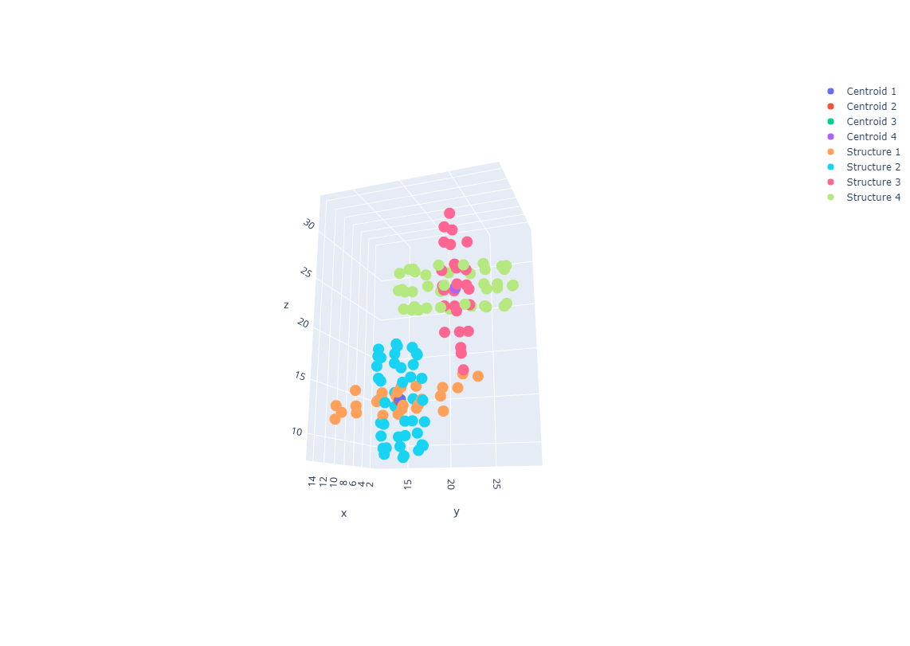

# cbn_analysis - an automated command line tool for visualizing and measuring ellipticity of cucurbituril host/guest structures

## How to install
** This package is not yet pip installable, but once it is available, the command will be a simple

_pip install cbnanalysis_

** Until then, the installation of the package can be done by the following:
* Clone this git repository to your local machine
* In the cloned repository, install the cbn_analysis package through _python -m pip install . vv_ 
* Next, install the required dependencies by running _pip install -r requirements.txt_

## How to run the analysis

## How to interpret the output

[Interactive version found here](https://plotly.com/~Mshavlik/63/)

