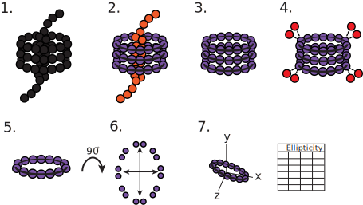

# ElliptiCB*[n]*

## Automatically measure the ellipticity of cucurbituril macrocycles


### Run on Google Colab

Run the program in the cloud without installing any software. 

<a href="https://githubtocolab.com/harmslab/ElliptiCBn/blob/main/notebooks/ElliptiCBn.ipynb" target="_parent"></a>


### Description

*ElliptiCB*[n]* is a collaboration between the Pluth and Harms labs at the University of Oregon*

Arman Garcia, Michael Shavlik PhD, Mike Harms PhD, Mike Pluth PhD

A manuscript describing the software is forthcoming.


#### ElliptiCB*[n]* performs the following steps



1. Extract the coordinates of all C, N, O, and H atoms from an xyz file.

2. Identify separate molecules by finding strongly-connected components.

3. Identify macrocycles using patterns of bonds, cycle connectivity and cycle size. 

5. Use a Principal Component Analysis to calculate the variance along both major axes of the central cycle.

6. Calculate ellipticity. This is done by two methods:

   A.  *pca_ellip*: $(V_{ax1}-V_{ax2})/V_{ax1}$ where $V_{ax1}$ is the PCA variance on the longest axis (length) and $V_{ax2}$ is the PCA variance on the second-longest axis (width).  

   B.  *orig_ellip*: Use the perimeter and largest carbon-to-centroid distance to infer ellipticity.

7. Generate outputs, which include annotated structures and a spreadsheet with ellipticities.

### Input

ElliptiCB*[n]* takes molecular structures in [XYZ format](https://en.wikipedia.org/wiki/XYZ_file_format). The first two lines are ignored. We assume the coordinates are in angstroms. XYZ files can be generated from other structure formats using software like [Open Babel](http://openbabel.org). 

### Output

Output of a calculation using the structure [HUXMAR](https://dx.doi.org/10.5517/ccdc.csd.cc261f8z) as input.

#### Ellipticity table

| id   | size | pca_ellip | orig_ellip | nearby_atoms | bad_protons | 
| ---- | ---- | --------- | ---------- | ------------ | ----------- | 
| 0    | 20   | 0.121369  | 0.123284   | 2            | 0           | 
| 1    | 10   | 0.018906  | 0.066456   | 2            | 0           | 
| 2    | 14   | 0.075018  | 0.087605   | 10           | 0           | 


+ "id": identity of the cycle (matching the visualization and table)
+ "size": number of equatorial glycoluril sp3 carbons in the macrocycle
+ "pca_ellip": ellipticity calculated by Principle Component Analysis
+ "orig_ellip" ellipticity calculated the centroid, nearest carbon, and perimeter.
+ "nearby_atoms": number of atoms from a different molecule within GUEST_SEARCH_RADIUS
  of the macrocycle centroid. (Useful for identifying guests).
+ "bad_protons": number of equatorial protons facing into rather than out of the
  macrocycle. 

#### Annotated structure

A screenshot of the output follows. The actual output of the code is interactive. An example is [here](images/exmar_huxmar-page.html). 


### Local installation

ElliptiCB*[n]* can be installed locally and used as a command line tool. 

**To install using pip**

On a terminal, run:

```bash
pip install ElliptiCBn
```

**To install from source:**

On a terminal, run:

```bash
git clone https://github.com/harmslab/ElliptiCBn.git
cd ElliptiCBn
python -m pip install . -vv -r requirements.txt
```

### Run from the command line

ElliptiCB*[n]* takes one or more .xyz files as inputs. Assuming that HUMAR.xyz is in the working directory, running this command:

```
$> ElliptiCBn HUMXAR.xyz
```

Would generate the following output:

```
Analyzing ./CB10/HUMXAR.xyz.
3 macrocycles identified.

Calculating ellipticities for 3 macrocycles.

Results:
    id  size  pca_ellip  orig_ellip  nearby_atoms  bad_protons
0  0.0    20   0.121369    0.123284             2            0
1  1.0    10   0.018906    0.066456             2            0
2  2.0    14   0.075018    0.087605            10            0

Saving plot to ./HUMXAR.xyz.html
```

It will also generate HUXMAR.xyz.html (the visualization) and HUXMAR.xyz.xlsx (the ellipticity table) in the current directory. 

You can also run the program on multiple xyz files:

```
$> ElliptiCBn HUMXAR.xyz LAZPIM.xyz
```

Would generate the following output:

```
Analyzing HUMXAR.xyz.
3 macrocycles identified.

Calculating ellipticities for 3 macrocycles.

Results:
    id  size  pca_ellip  orig_ellip  nearby_atoms  bad_protons
0  0.0    20   0.121369    0.123284             2            0
1  1.0    10   0.018906    0.066456             2            0
2  2.0    14   0.075018    0.087605            10            0

Saving plot to ./HUMXAR.xyz.html

Analyzing LAZPIM.xyz.
1 macrocycles identified.

Calculating ellipticities for 1 macrocycles.

Results:
    id  size  pca_ellip  orig_ellip  nearby_atoms  bad_protons
0  0.0    20    0.29813    0.212848            20            0

Saving plot to ./LAZPIM.xyz.html
```

In addition to the visualization html and individual ellipiticty files, this call would generate a single spreadsheet ("summary.xlsx") that has all calculated ellipticities:

| id   | size | pca_ellip | orig_ellip | nearby_atoms | bad_protons | file       |
| ---- | ---- | --------- | ---------- | ------------ | ----------- | -----------|
| 0    | 20   | 0.121369  | 0.123284   | 2            | 0           | HUMXAR.xyz |
| 1    | 10   | 0.018906  | 0.066456   | 2            | 0           | HUMXAR.xyz |
| 2    | 14   | 0.075018  | 0.087605   | 10           | 0           | HUMXAR.xyz |
| 0    | 20   | 0.29813   | 0.212848   | 20           | 0           | LAZPIM.xyz |

One can also change the parameters used in the calculation. To see the available options, type the following in a terminal:

```bash
ElliptiCBn --help
```

As of this writing (version 2.0.1), this gives the following output:

```
usage: ElliptiCBn [-h] [--min_num_carbons MIN_NUM_CARBONS]
                  [--max_num_carbons MAX_NUM_CARBONS]
                  [--guest_search_radius GUEST_SEARCH_RADIUS]
                  [--summary_file SUMMARY_FILE] [--output_dir OUTPUT_DIR]
                  [--overwrite] [--version]
                  filename [filename ...]

    Run an ElliptiCbn calculation.

    Parameters
    ----------
    filename : str or list
        xyz file name (or list of xyz files) to read
    min_num_carbons : int, default=10
        reject any macrocycle with a central cycle that has less than
        min_num_carbons
    max_num_carbons : int, default=20
        reject any macrocycle with a central cycle that has more than
        max_num_carbons
    guest_search_radius : float, default=4
        look for guest atoms within this radius (in angstroms) of the atom
        centroid.
    summary_file : str, default="summary.xlsx"
        write all cycles to this single summary file if there is more than one
        xyz file specified.
    output_dir : str, default="."
        write output to output_dir.
    overwrite : bool, default=False
        overwrite existing output files


positional arguments:
  filename

options:
  -h, --help            show this help message and exit
  --min_num_carbons MIN_NUM_CARBONS
  --max_num_carbons MAX_NUM_CARBONS
  --guest_search_radius GUEST_SEARCH_RADIUS
  --summary_file SUMMARY_FILE
  --output_dir OUTPUT_DIR
  --overwrite
  --version             show program's version number and exit
```
