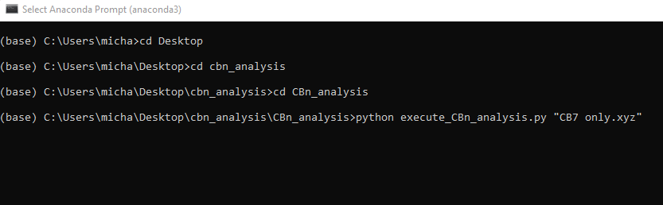
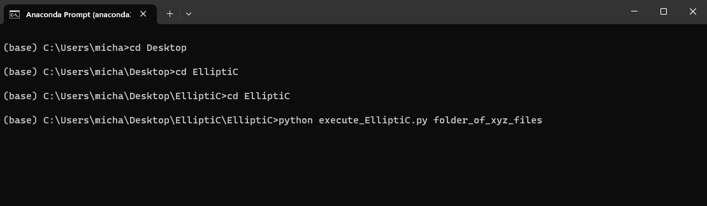
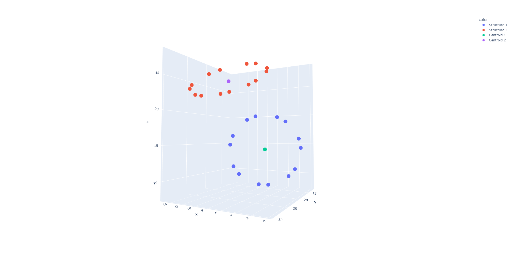
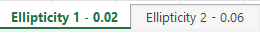
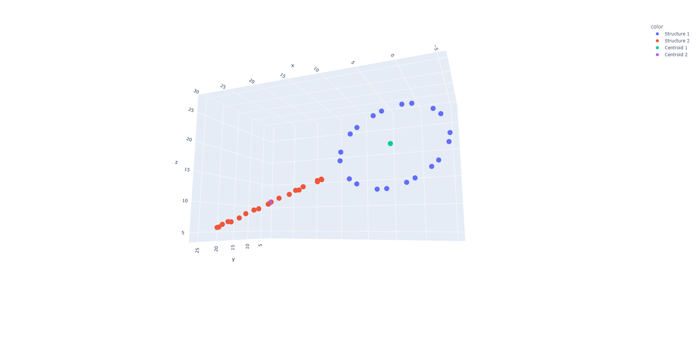

# ElliptiCBn - an automated command line tool for visualizing and measuring ellipticity of cucurbituril host/guest structures

 

## Run on Google Colab

## How to install
**In a terminal, the command for installation is a simple**

_pip install ElliptiCBn_

**If you would rather not use pip and prefer installing source, the installation of the package can be done by the following:**
* Clone this git repository to your local machine
* In the cloned repository, install ElliptiCBn through _python -m pip install . vv_ 
* Next, install the required dependencies by running _pip install -r requirements.txt_

 

## How to run the analysis
### The ElliptiCBn package takes a single command line argument: an xyz file containing atom coordinates, or a folder of xyz files containing atom coordinates

**To run the analysis package on a single file, navigate to the directory with the ElliptiCBn script and execute it:**
(NOTE: if there are spaces in your file name, you will need quotes around the file name)

**The same convention can be used to execute the package on a folder of xyz files**

    
 

## How the package works
### Below is a diagram of the analysis steps the software completes on any given file

### 1. In a given XYZ file, extract the coordinates of all carbon atoms (and oxygen atoms used later on in the analysis).
### 2. Identify strongly connected components to differentiate between host and guest structures.
### 3. Remove the guest structure since we only care about calculating ellipticity of the host.
### 4. Using proximity to oxygen atoms, remove the top and bottom rings of the hosts for accurate ellipticity calculation.
### 5 & 6. Using a Principal Components Analysis, calculate the variance along both major axes of the host ring. The ellipticity is thus (Vax1-Vax2)/Vax1 where Vax1 is the variance on the longest axis (length) and Vax2 is the variance on the second-longest axis (width). 
### 7. Output graphs of both the single ring hosts and the full host-guest structures, as well as a spreadsheet with the calculated ellipticity for each structure.

 
 

## How to interpret the output

### Each xyz file analyzed with this package will produce at least 3 pieces of data: 
* 1 interactive 3D scatter plot with all carbons in the CBn structures visualized 
* 1 interactive 3D scatter plot with only the central carbon ring of the CBn structures visualized
* 1 spreadsheet with all of the carbons, their positions, distance to the centroid of the structure, and the measured ellipticity

**In the case of host CBn structures with an internally situated guest structure, an additional 3D graph will be produced with the guests visualized in the structures (see below)**

To see the interactive version of this plot that gets generated from the script, [Click Here](https://plotly.com/~Mshavlik/63/)

**The user can visually see the ellipticity in the structues and compare them to the measured values in the spreadsheets:**                 
_CB7 structures from above with guests removed_

Calculated ellipticity for each structure on a scale of circular (0) to linear (1)  

_CB10 wide structures with guests removed_

Calculated ellipticity for each structure on a scale of circular (0) to linear (1)  

